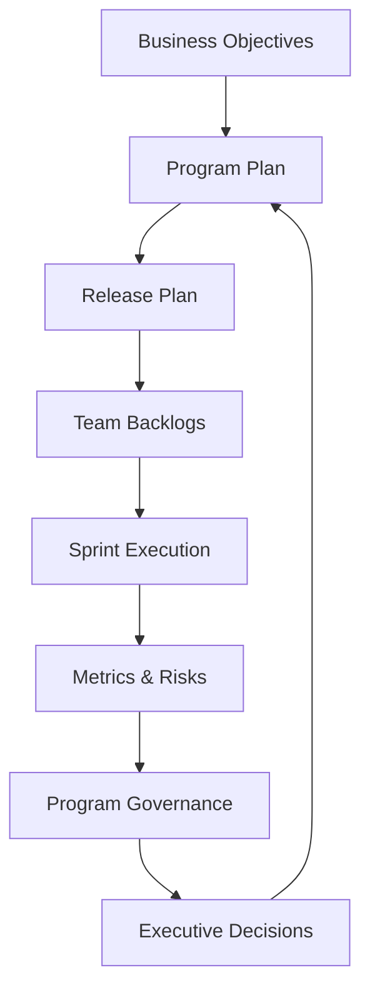

# Agile Program Governance Toolkit

Reusable governance templates for program managers, delivery managers, Scrum Masters, and PMO leaders managing multi-team technology programs.

The toolkit is intentionally generic and does not contain proprietary customer or employer information.

## Included artifacts

- RAID log template
- Sprint velocity tracker
- Executive status report
- Dependency-management template
- Program governance cadence

## Governance model

## Recommended governance cadence

| Cadence | Forum | Focus |
|---|---|---|
| Daily | Team stand-up | Delivery progress and blockers |
| Weekly | Program review | Milestones, RAID, dependencies |
| Biweekly | Sprint review / planning | Increment and next sprint |
| Monthly | Steering committee | Decisions, budget, scope, risks |
| Quarterly | Roadmap review | Outcomes, priorities, capacity |

## Core delivery metrics

- Sprint predictability
- Velocity trend
- Release burn-up
- Milestone health
- Dependency aging
- Risk exposure
- Defect leakage
- Budget variance
- Capacity versus demand

## Leadership principle

Governance should create visibility and decisions—not unnecessary reporting overhead.
